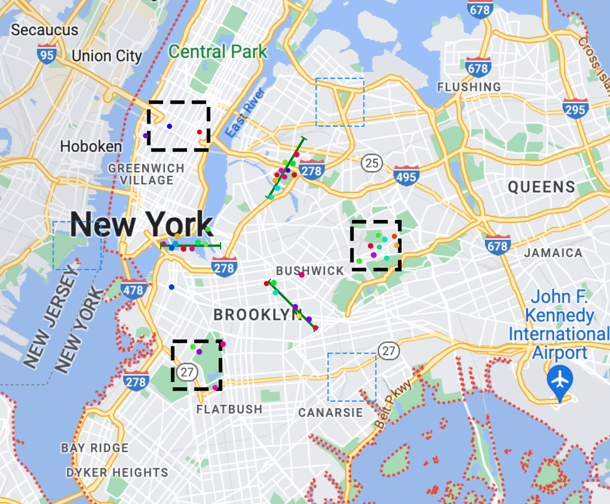
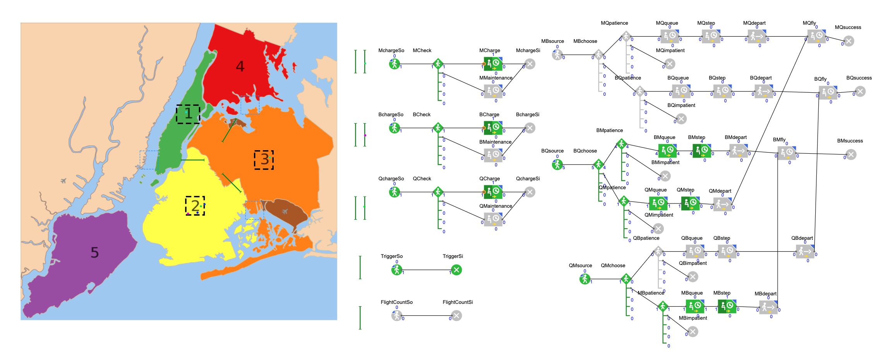

# AAE560-PropulsionConfigurationsSoS
Agent based model for analyzing propulsion systems of systems for Urban Air Mobility, including occupant variations for eVTOLs and hybrid vehicles.

We conducted four different analysis for our system of system for each configuration: 4 person and 6 person hybrid and electric vehicles. 

